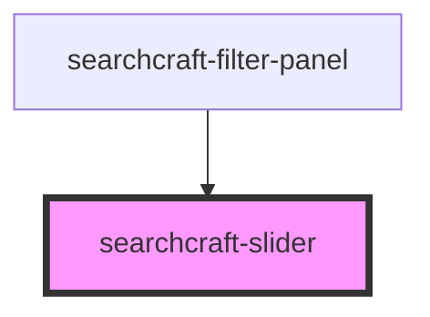

# searchcraft-slider

<!-- Auto Generated Below -->

## Overview

This web component is designed to allow users to select a value from a range defined by a minimum and maximum value.
The component renders a slider interface, which can be used to visually choose a value between two boundaries.
It is consumed by the `searchcraft-filter-panel` component.

## Properties

| Property      | Attribute     | Description                                    | Type                 | Default              |
| ------------- | ------------- | ---------------------------------------------- | -------------------- | -------------------- |
| `dataType`    | `data-type`   | The type of data allowed.                      | `"date" \| "number"` | `'number'`           |
| `granularity` | `granularity` | The granularity that the value must adhere to. | `number`             | `getMillis('month')` |
| `max`         | `max`         | The maximum value allowed.                     | `number`             | `100`                |
| `min`         | `min`         | The minimum value allowed.                     | `number`             | `0`                  |

## Events

| Event          | Description                 | Type                                                     |
| -------------- | --------------------------- | -------------------------------------------------------- |
| `rangeChanged` | When the range has changed. | `CustomEvent<{ startValue: number; endValue: number; }>` |

## Dependencies

### Used by

 - [searchcraft-filter-panel](../searchcraft-filter-panel)

### Graph

----------------------------------------------

*Built with [StencilJS](https://stenciljs.com/)*
