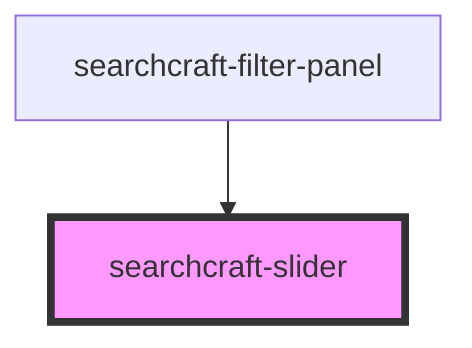

# searchcraft-slider

<!-- Auto Generated Below -->

## Properties

| Property      | Attribute     | Description | Type     | Default              |
| ------------- | ------------- | ----------- | -------- | -------------------- |
| `granularity` | `granularity` |             | `number` | `getMillis('month')` |
| `max`         | `max`         |             | `number` | `100`                |
| `min`         | `min`         |             | `number` | `0`                  |

## Events

| Event          | Description | Type                                                     |
| -------------- | ----------- | -------------------------------------------------------- |
| `rangeChanged` |             | `CustomEvent<{ startValue: number; endValue: number; }>` |

## Dependencies

### Used by

 - [searchcraft-filter-panel](../searchcraft-filter-panel)

### Graph

----------------------------------------------

*Built with [StencilJS](https://stenciljs.com/)*
