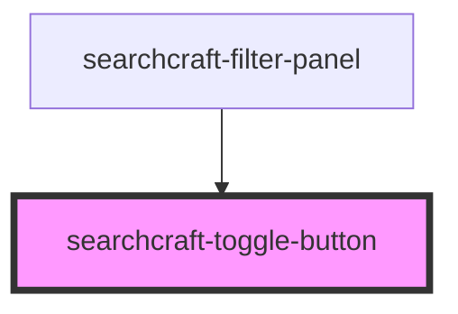

# searchcraft-toggle-button

<!-- Auto Generated Below -->

## Properties

| Property   | Attribute   | Description                                                                                                                            | Type     | Default     |
| ---------- | ----------- | -------------------------------------------------------------------------------------------------------------------------------------- | -------- | ----------- |
| `label`    | `label`     | Type of the toggle - determines what it controls 'mode': toggles between 'fuzzy' and 'normal' 'sort': toggles between 'asc' and 'desc' | `string` | `'Toggle'`  |
| `subLabel` | `sub-label` |                                                                                                                                        | `string` | `undefined` |

## Events

| Event           | Description | Type                   |
| --------------- | ----------- | ---------------------- |
| `toggleUpdated` |             | `CustomEvent<boolean>` |

## Dependencies

### Used by

 - [searchcraft-filter-panel](../searchcraft-filter-panel)

### Graph

----------------------------------------------

*Built with [StencilJS](https://stenciljs.com/)*
