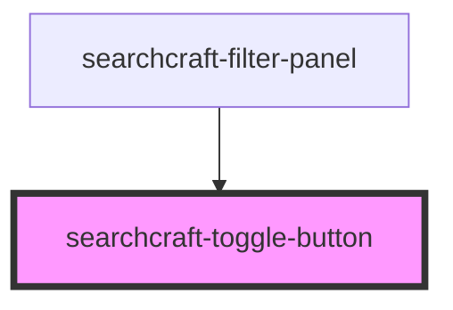

# searchcraft-toggle-button

<!-- Auto Generated Below -->

## Overview

This web component simulates a light switch functionality, providing a simple and intuitive toggle between two states—on and off.
It is consumed within the `searchcraft-filter-panel` component.

## Properties

| Property   | Attribute   | Description                                         | Type                  | Default     |
| ---------- | ----------- | --------------------------------------------------- | --------------------- | ----------- |
| `label`    | `label`     | The label.                                          | `string`              | `'Toggle'`  |
| `subLabel` | `sub-label` | The secondary label displayed below the main label. | `string \| undefined` | `undefined` |

## Events

| Event           | Description                         | Type               |
| --------------- | ----------------------------------- | ------------------ |
| `toggleUpdated` | When the toggle element is changed. | `CustomEvent<any>` |

## Dependencies

### Used by

 - [searchcraft-filter-panel](../searchcraft-filter-panel)

### Graph

----------------------------------------------

*Built with [StencilJS](https://stenciljs.com/)*
