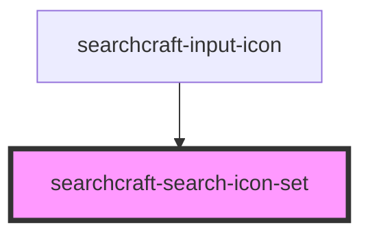

# searchcraft-search-icon-set

<!-- Auto Generated Below -->

## Properties

| Property | Attribute | Description                                                                                      | Type                                                               | Default         |
| -------- | --------- | ------------------------------------------------------------------------------------------------ | ------------------------------------------------------------------ | --------------- |
| `type`   | `type`    | Type of the icon to display. Options: ''search-light', search-dark', 'error-light', 'error-dark' | `"error-dark" \| "error-light" \| "search-dark" \| "search-light"` | `'search-dark'` |

## Dependencies

### Used by

 - [searchcraft-input-icon](../components/searchcraft-input-icon)

### Graph

----------------------------------------------

*Built with [StencilJS](https://stenciljs.com/)*
