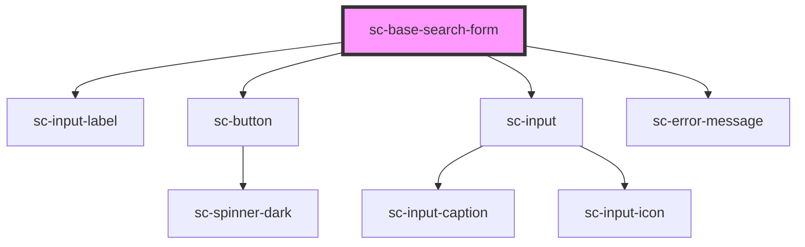

# sc-base-search-form

<!-- Auto Generated Below -->

## Properties

| Property                 | Attribute                   | Description | Type      | Default                     |
| ------------------------ | --------------------------- | ----------- | --------- | --------------------------- |
| `errorMessage`           | `error-message`             |             | `string`  | `'Search was unsuccessful'` |
| `labelForInput`          | `label-for-input`           |             | `string`  | `'Search'`                  |
| `rightToLeftOrientation` | `right-to-left-orientation` |             | `boolean` | `false`                     |

## Dependencies

### Depends on

- [sc-input-label](../sc-input-label)
- [sc-button](../sc-button)
- [sc-input](../sc-input)
- [sc-error-message](../sc-error-message)

### Graph

----------------------------------------------

*Built with [StencilJS](https://stenciljs.com/)*
