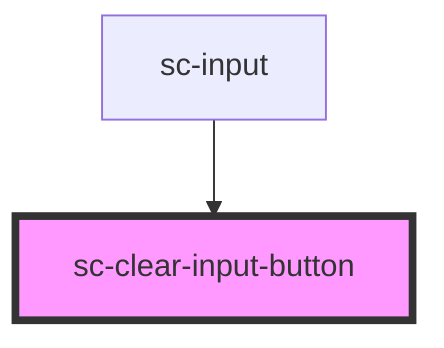

# sc-clear-input-button

<!-- Auto Generated Below -->

## Properties

| Property                 | Attribute                   | Description | Type      | Default |
| ------------------------ | --------------------------- | ----------- | --------- | ------- |
| `isRequesting`           | `is-requesting`             |             | `boolean` | `false` |
| `rightToLeftOrientation` | `right-to-left-orientation` |             | `boolean` | `false` |

## Events

| Event        | Description | Type                |
| ------------ | ----------- | ------------------- |
| `clearInput` |             | `CustomEvent<void>` |

## Dependencies

### Used by

 - [sc-input](../sc-input)

### Graph

----------------------------------------------

*Built with [StencilJS](https://stenciljs.com/)*
