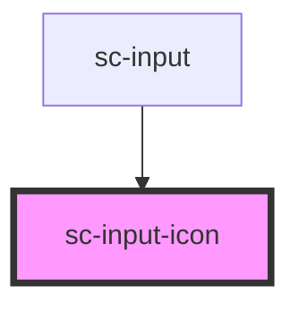

# sc-input-icon

<!-- Auto Generated Below -->

## Properties

| Property                 | Attribute                   | Description | Type      | Default     |
| ------------------------ | --------------------------- | ----------- | --------- | ----------- |
| `error`                  | `error`                     |             | `boolean` | `undefined` |
| `rightToLeftOrientation` | `right-to-left-orientation` |             | `boolean` | `false`     |

## Dependencies

### Used by

 - [sc-input](../sc-input)

### Graph

----------------------------------------------

*Built with [StencilJS](https://stenciljs.com/)*
